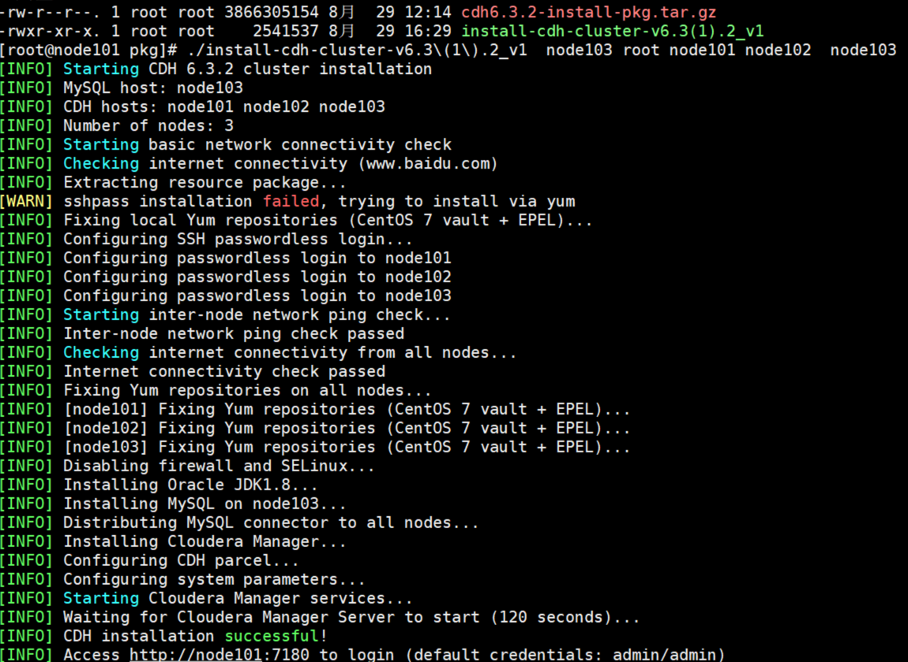

# bigdata-cluster-script

### install-cdh-cluster-v6.3.2_v1
``` 
1. 该脚本为go编译的二进制文件 可直接执行
./install-cdh-cluster-v6.3.2_v1 <mysql_host> <root_password> <cdh_host1> <cdh_host2> <cdh_host3> [cdh_host4 cdh_host5]

2. 在 /opt/pkg下需要有cdh6.3.2-install-pkg.tar.gz 这个包
3. 待安装的主机 需要配置hostname 并调通内网和外网
```
> 